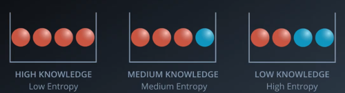
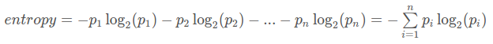
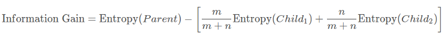
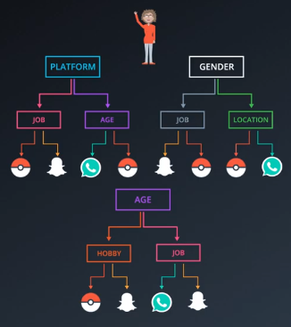

# **Decision Trees**

### **Entropy**

The entropy can be explained as the knowledge we have that a distribution will give a specific result. The entropy is the "opposite" of knowledge: high knowledge means low entropy and vice versa.

For example, if there is a bucket with red balls and blue balls, if the distribution is 50/50, there is a high entropy because we have a low knowledge that the ball we are going to pick up at random is the color red. In the other hand if the distribution is 90/10 for red/blue balls we have a high knowlege that the ball we pick up will be red, therefore the entropy is low.

The entropy is calculated by multiplying the probabilities of obtaining the result we expect each time. For example the chances of picking a red ball are 0.75 for the middle bucket and 0.25 for the blue ball. If we expect a red ball and get a red ball there were 0.75% chances that red was going to come out. If we expect red and get a blue instead, the chances are 1-0.75 = 0.25 of getting blue. We do this a few times, and multiply the result, giving us the entropy.

However we want to avoid product of small numbers as much as possible, therefore we do the sum of the logarithms of the probabilites. Where p_1 and p_2 are the probabilities of each event happening in a distribution.

### **Information Gain**

Tells us if we have gained any "insights" about the information with the split.

It is calculated by calculating the average of the children's entropies and subtracting it to the parent's entropy.

When we divide our data using one of the features, we choose the feature that gives us the most information gain with the split.

### **Random Forests**

Decision trees tend to overfit.

Random forests consist of picking some of the features randomly (eg. age and sex or job and location ...) and building decision trees for that. Once we have a few trees we make a prediction with the same input for all trees, and let them vote. The result that repeats the most wins.

In the example above if all the trees decide she will download whatsapp, whatsapp and pokemon respectively, the final decision will be whatsapp because it is the one that repeats the most.

### **Hyperparameters**

* **Maximum Depth**: The maximum possible length between the root to a leaf.

* **Minimum number of samples to split**: The minimum amount of samples the node needs to have to split.

* **Mimum number of samples per leaf**: The minimum samples one of the leafs needs to have after the split for the split to take place. When splitting a node, one could run into the problem of having 99 samples in one of them, and 1 on the other. This will not take us too far in our process, and would be a waste of resources and time. If we want to avoid this, we can set a minimum for the number of samples we allow on each leaf.

