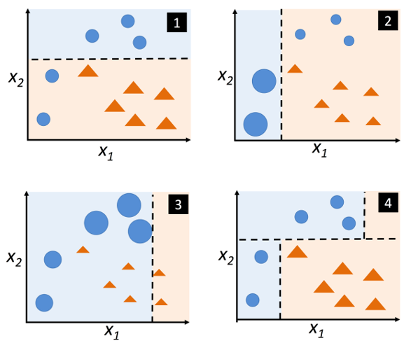
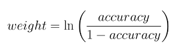

# **Ensemble Methods**

The goal of **ensemble methods** is to combine different classifiers into a metaclassifier that has better generalization performance than each individual classifier alone.

### **Bagging**

Bagging is a technique that consists on training different weak learners with  with a random subset of the training set. Then we make prediction with each weak learner and choose the prediction that repeats the most (Majority voting for classification), or average the results (average for regression). The random subset of the training set can include repeated data, as well as not considering some of the data.

Weak learners are very simple models that don't classify the data very well. However because we will have a lot of data and a lot of weak learners, this combined with only using a subset of the samples for each weak learner will help the computations run fast. In reality we only need the weak learners to perform slightly better than random chance to obtain a good result. 

### **Adaboost**

Boosting consists of very simple classifiers (weak learners) which have a slight performance over random guessing. The objective is to let the weak learners subsequently learn from the misclassified trainin samples to improve performance of the ensemble.

In constrast to the original boosting, AdaBoost uses the complete trainin set to train the weak learners where the trainnig samples are reweighted on each iteration to build a strong classifier that learns from the mistakes of the previous weak learner in the ensemble.

The process goes as follows:
1) We fit our first weak learner in order to maximize accuracy, equivalently, to minimize our number of errors. In this case we can't do less than two errors.
2) The second learner needs to fix on the mistakes that the first one has made. So we take the misclassified points and make them bigger. In other words, we will punish the model more if it misclassifies the bigger points.
3) The third weak learner tries to correctly classify all the big points that ocurred from misclassifying them in 1 and 2.
4) Finally we combine all our models into one that will make accurate predictions.

In a more mathematical way the process can be described as follows.
1) Initially we assign all our points the same weight, lets say they all have a **weight of 1**. Then we fit our first learner to separate our points. Before, we wanted to minimize the number of errors, **now we want to minimize the sum of weights of incorrectly classified points**. Once we sum the weights of all the **correct classified points, we get 9**, and the sum of the **incorrectly classified points is 2**. Now we update the weights of the misclassified points, so that they add up to to the same amount as the correctly classified ones. In our case **both blue circles will have a weight of 4.5**.
2) Then we fit our new weighted data using a new model, which will fit the newly weighted data best, which is the circles with the large weights. We add the weights as we've done before: **the correctly classified points sum up to 15**, and the **misclassified points sum up to 3**. Again, we update the weights of the misclassified points so that they add up to the same as the correctly classified ones. In this case **each of the misclassified points (the three top blue ones in this case) will have an updated weight of 5**.
3) Then we want to fit our newly weighted data with a new model. In this case the model will try to classify correctly the points with bigger weights. We apply the same procedure of adding the weights... and repeat this iteration for as many times as we want.
4) a) Finally we want to combine the models to make a prediction. However we want to weight them first by how well they are doing. A model that always tells the truth will have a large weight, as well as a model that is always worng, since all we need to do is to do the opposite as what the model says (large negative weight). A model that gives a good prediction 50% of the time will have a weight close to 0, since it is very unpredictable. Therefore an accuracy of 0.5 should result in a small weight (because it gives unpredictable results) an an accuracy close to 0 (always wrong) or close to one (always right) should get a bigger weight. The formula is as follows: 

4) b) Now it is time to actually combine the models. For our three models the weights will be:
    * 1) ln(0.82/0.18) = 1.52
    * 2) ln(0.73/0.27) = 0.99
    * 3) ln(0.64/0.36) = 0.58
  
    To combine them we do majority voting, except we multiply each vote by the corresponding weight.
    

## **Resources**

[Python Machine Learning Second Edition](https://www.amazon.com/Python-Machine-Learning-scikit-learn-TensorFlow/dp/1787125939)

[Machine Learning Nanodegree](https://www.udacity.com/course/machine-learning-engineer-nanodegree--nd009t)