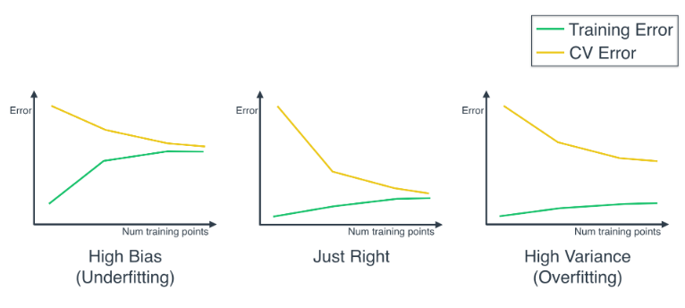

# **Evaluation Metrics and Model selection**

## **Evaluation metrics**

### **Confusion Matrix**
 |            | **Guessed Positive** | **Guessed Negative** |
 |----  |---- |----  |
 |**POSITIVE**    |True Positives (TP)  |False Negatives (FN) |
 |**NEGATIVE**    |False Positives (FP) |True Negative (TN) |
 |||

 The confusion matrix helps us identify how well our model is doing:
  * **True positives**: a point with label *positive* is classified as positive.
  * **True negatives**: a point with label *negative* is classified as negative.
  * **False positives**: a point with label *negative* is classified as positive.
  * **False negatives**: a point with label *positive* is classified as negative.

  ### **Accuracy**
  It answers the question: out of all the data points how many did we classify correctly?
  
  It is the ratio of all the correctly classified points, divided by all the points.

  * Accuracy =  *(True Positives + True Negatives) / total_number_of_points*

  Problems with the accuracy:
  * When the distribution of training data is skwed, it can give a very good accuracy even though the model performs badly.
  * For example, if 95% of our data has a label _y_ and 5% a label _x_, the labels _y_ will have a lot more weight when calculating the accuracy. Even if we have a model where all the labels _x_ are misclasified, we will still get a great accuracy score.

  ### **Precision**
  It answers to the question: out of all the points predicted to be positive, how many were actually positive?

  * Precision = *TP / (TP + FP)*

  Precision is very important when we want to avoid False Positives as much as possible. 
  
  In the example of a spam-email classifier, precision will be very important, as want to avoid sending non spam emails to the spam folder (False Positive). However in a medical example where we diagnose patients, precision won't be as important since classifying a healthy patient as sick (False Positive) won't do any harm.

### **Recall**

It answers to the question: from all the points labeled as *Positive*, how many were actually classified as Positive.

* Recall = *TP / (TP + FN)*

Recall is very important when we want to avoid False Negatives as much as possible.

In the example of a spam-email classifier, recall won't be very important, as we don't mind that much if a spam email makes it into our inbox (False Negative). However in a medical example where we diagnose patients, recall will be extremely important since misclassifying a sick patient as healthy (False Negative) can have really bad consequences.

### **F1 Score** 

It combines both Precision and Recall into one score. It is calculated by performing the arithmetic mean over Recall and Precision.

* F1 Score = *2 * (Precision * Recall) / (Precision + Recall)*

As we can see this scoring system is a lot more informative when working with skewed datasets.

### **F-Beta Score**
​	
For some models it might be more important to have a higher precision (spam identifier) or a higher recall (medical example). In this case we use F-Beta score, so we can have a score skwed towards the metric more important to us.

* Fß  Score = *(1 + ß2) * (Precision * Recall) / (ß2 * Precision + Recall)* 

### **ROC Curve**

Identifies how well the data can be splitted in a binary classification. The curve is plotted by calculating two ratios:
* True Positive Rate = *TP/All Positives*
* True Negative Rate = *FP/All Negatives*

We calculate this ratios by plotting random curves (think of it as a 1 dimensional graph). Then we plot the results in a two dimensional graph. If the area is 1, it means the data can be splitted perfectly. 0.5 means the data is pretty random (wherever you plot the line, you'll always get half the data on one side and half the data on the other)

### **R2 Score**

Comparing our model to the simplest possible model. The simples model can be calculated by calculating the average of all our points and draw a line through there.

After that, we calculate the mean squared error from both models and compare them. We would expect the simple model to have a much larger error than the good model. 

* R2 = *1 - (Error Good model/Error simple model)*

Where a score near 0 means it is a bad model, whereas a score near 1 means it is a good model.

### **K-Fold Cross Validation**

Cross validation is used to see how well our model is doing predictions during training. It is done by dividing our data into three parts: train, validation, and test. We use train and validation during training, and test at the very end, to make sure our model makes good predictions.

However when we divide the data into train, validation and test, a lot of data is is getting "wasted" that could be used during training. K-Fold CV consists on splitting our train data into k-buckets, where we leave one of the buckets for validation. Then, we train the model k-times with different buckets for validation each time. When we get all the results, we take the average of all the training results to get an averaged result.

This is useful because it not only recicles some of the validation data, but also because by using different buckets for validation each time we decrease the error by splitting our data one way or the other, as having different train/validation splits can affect the precision of the model.

### **Learning Curves**

**Underfitting**: our model is too simple for the dataset. The training error will start low for fewer training points, however it will increase as more training points are added because the model is too simple and can't possibly classify some of the points. The cross validation error will decrease as more training points are added, however it will never get a low error since the model is too simple to properly classify some of the points. For this model, adding more data points won't help.

**Overfitting**: our model is too complex for the dataset. The training error will start low, and stay low, as more training points are added the model will memorize the data more and more. For the cross validation error it will start to decrease however it will never reach a low error. This is because the model is too complex and therefore is memorizing the data, which will cause that the model will misclasify data points that has neven seen before.

 ## **Resources**
 Udacity: [Machine Learning Nanodegree](https://www.udacity.com/course/machine-learning-engineer-nanodegree--nd009t)