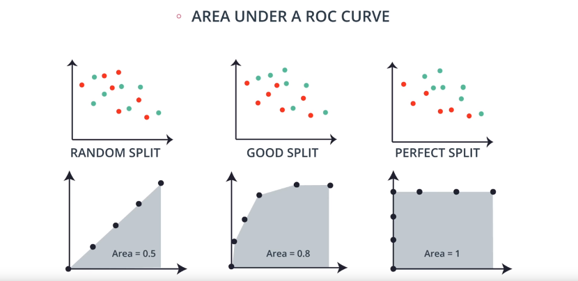

# **Evaluation Metrics and Model selection**

## **Evaluation metrics**

### **Confusion Matrix**
 |            | **Guessed Positive** | **Guessed Negative** |
 |----  |---- |----  |
 |**POSITIVE**    |True Positives (TP)  |False Negatives (FN) |
 |**NEGATIVE**    |False Positives (FP) |True Negative (TN) |
 |||

 The confusion matrix helps us identify how well our model is doing:
  * **True positives**: a point with label *positive* is classified as positive.
  * **True negatives**: a point with label *negative* is classified as negative.
  * **False positives**: a point with label *negative* is classified as positive.
  * **False negatives**: a point with label *positive* is classified as negative.

  ### **Accuracy**
  It answers the question: out of all the data points how many did we classify correctly?
  
  It is the ratio of all the correctly classified points, divided by all the points.

  * Accuracy =  *(True Positives + True Negatives) / total_number_of_points*

  Problems with the accuracy:
  * When the distribution of training data is skwed, it can give a very good accuracy even though the model performs badly.
  * For example, if 95% of our data has a label _y_ and 5% a label _x_, the labels _y_ will have a lot more weight when calculating the accuracy. Even if we have a model where all the labels _x_ are misclasified, we will still get a great accuracy score.

  ### **Precision**
  It answers to the question: out of all the points predicted to be positive, how many were actually positive?

  * Precision = *TP / (TP + FP)*

  Precision is very important when we want to avoid False Positives as much as possible. 
  
  In the example of a spam-email classifier, precision will be very important, as want to avoid sending non spam emails to the spam folder (False Positive). However in a medical example where we diagnose patients, precision won't be as important since classifying a healthy patient as sick (False Positive) won't do any harm.

### **Recall**

It answers to the question: from all the points labeled as *Positive*, how many were actually classified as Positive.

* Recall = *TP / (TP + FN)*

Recall is very important when we want to avoid False Negatives as much as possible.

In the example of a spam-email classifier, recall won't be very important, as we don't mind that much if a spam email makes it into our inbox (False Negative). However in a medical example where we diagnose patients, recall will be extremely important since misclassifying a sick patient as healthy (False Negative) can have really bad consequences.

### **F1 Score** 

It combines both Precision and Recall into one score. It is calculated by performing the arithmetic mean over Recall and Precision.

* F1 Score = *2 * (Precision * Recall) / (Precision + Recall)*

As we can see this scoring system is a lot more informative when working with skewed datasets.

### **F-Beta Score**
​	
For some models it might be more important to have a higher precision (spam identifier) or a higher recall (medical example). In this case we use F-Beta score, so we can have a score skwed towards the metric more important to us.

* Fß  Score = *(1 + ß2) * (Precision * Recall) / (ß2 * Precision + Recall)* 

### **ROC Curve**

Identifies how well the data can be splitted in a binary classification. The curve is plotted by calculating two ratios:
* True Positive Rate = *TP/All Positives*
* True Negative Rate = *FP/All Negatives*

We calculate this ratios by plotting random curves (think of it as a 1 dimensional graph). Then we plot the results in a two dimensional graph. If the area is 1, it means the data can be splitted perfectly. 0.5 means the data is pretty random (wherever you plot the line, you'll always get half the data on one side and half the data on the other)

