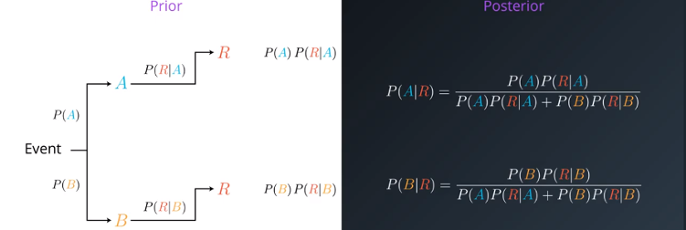
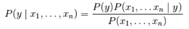

# **Naive Bayes**

Naive Bayes is a more probabilistic algorithm, which is based on the concept of conditional probability. Some of the benefits of this algorithm is that it is easy to implement and fast to train.

### **Bayes Theorem**

Te bayes theorem consists on updating the probabilities after new information arrives. Therefore, it consists of two items: the posterior which is the original probability, and the posterior which is the new information (a probability).

The image on the left represents the bayes theorem. Given an event we have to probabilities A and B. For each probability we have the probabilities R. We can calculate the probability of R happening by multiplying A by the probability of R given A (R|A). Then, to calculate the probability of A given R, we apply the formula on the right. Note that what we are doing is simply dividing one probability by the overall probabilities so that they end up adding to 1.

### **Naive Bayes**
 
 In naive bayes we assume that our probabilities are independent. This, in real life is false, however it works well, and makes the algorithm very fast.

 

which is equivalent to:

* P(y|x_0,...,x_n) = [P(x_0 | y) * ... * P(x_n | y) * P(A)] **/** [P(x_0) * ... * P(x_n)]

 ## **Resources**
 Udacity: [Machine Learning Nanodegree](https://www.udacity.com/course/machine-learning-engineer-nanodegree--nd009t)