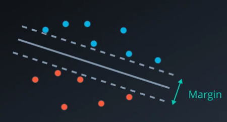
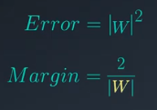
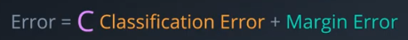
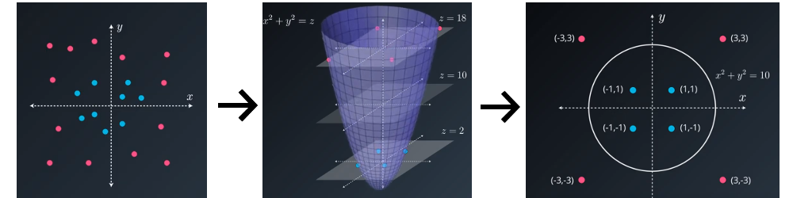

# **Support Vector Machines**

They are an extension of the perceptron algorithm, except our goal is to maximize the margin. The margin is defined as the distance between the decision boundary (our classification function) and the training samples that are closest to this boundary, which are the so called support vectors.

### **Error Function**

We want to maximize the margin as much as possible. To do this we add a margin, which can be represented by drawing two equidistant parallel lines from the main line.  We'll try to make that margin as wide as possible.

In a nutshell, our error will consist of the classification error plus the margin error. Once we have this, we apply gradient descent to minimize the error.

#### **Classification Error**
First we need to calcualte the classification error. This is going to be the same as when we classify our points in our perceptron algorithm with **Wx + b = 0**, except this time we'll make the boundary for the blue points the top line **Wx + b = 1**, and the boundary for the red points **Wx + b = -1**. We calculate the error with the respective boundary and add it for all the misclasified points (in the perceptron algorithm we ignore the properly classified points).

#### **Margin Error**
Since our goal is to maximize the margin, we want to add a small error if the margin is large, and a large error if the margin is tiny.

The margin is the distance between the two outside lines. THe lines that define our margin are **Wx + b = 1**, and **Wx + b = -1**. Note that if we have two functions, one with weights (3,2) and another with weigths (6,4), the first one is going to  have a larger margin than the later one. That is because the second one (6,4) is twice the first one (3,2), and is still equal to 1. Therefore bigger weights mean the smaller the margin will be.

The error is the norm of W squared (which is adding the squared values of the weights), which funily enough is the same formula as the L2 regularization.

In the other hand if we want to know the margin Error, it can be calculated by dividing 2 by the norm of W, and the norm of W is the root square of the error.

#### **The C Parameter**

This parameter is a constant that multiplies the classification error. 

* For a large C, we focus more on properly classifying all the points, allowing a smaller margin.
* For a small C, we focus more on having a large margin, allowing more misclassified points.

### **Polynomial Kernel**

The basic idea behind Kernel Methods to deal with data that is not linearly separable, is to create non-linear combinations of the original features to project them into a higher-dimensional space via a mapping function where it becomes linearly separable.

* Example = (x_1, x_2) → (x_1, x_2, x2_1 + x2_2)

By using this trick we can use a higher dimension to separate our data, and the project it back to the previous dimension.

## **Resources**

[Python Machine Learning Second Edition](https://www.amazon.com/Python-Machine-Learning-scikit-learn-TensorFlow/dp/1787125939)

 [Machine Learning Nanodegree](https://www.udacity.com/course/machine-learning-engineer-nanodegree--nd009t)
