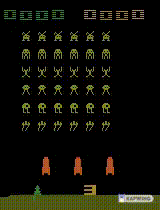

# PLAYING SPACE INVADERS WITH RL

## About

> Maximize your score in the Atari 2600 game SpaceInvaders. In this environment, the observation is an RGB image of the screen, which is an array of shape (210, 160, 3) Each action is repeatedly performed for a duration of kk frames, where kk is uniformly sampled from \{2, 3, 4\}{2,3,4}.

## Requirements

* numpy
* matplotlib
* tqdm
* gym[atari]
* keras

